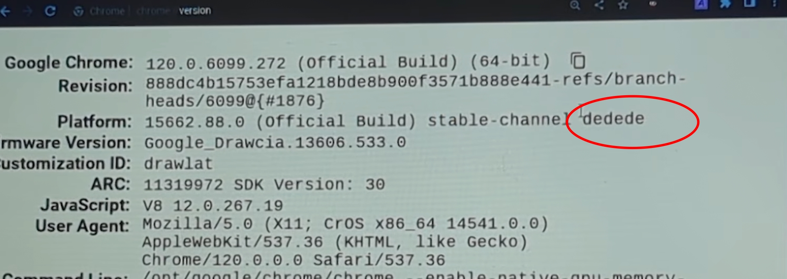

first install a prebuilt at [this link](https://github.com/ading2210/shimboot/releases)  your board name is what it should be 

# dd script           
             
i have made a small script that makes it easier to use dd by using ./dd and then some flags btw the          
like dashes before matter so the like single dash so ./dd -thing is your user as in /home/user          
mine is toby so it would be for me ./dd -toby then the two dashes so ./dd -toby --thing is your usb path thing      
use lsblk to find your usb and then type it here mine is /dev/sda so it is so far      
./dd -toby --/dev/sda and the final one is your board so in the full thing put ./dd -toby --/dev/sda ---dedede for me it will change for you,        
you may have a different board or usb         
location like /dev/sdb or smth            
       
# I FORGOT ABOUT THIS DO ``sudo -E bash ./dd`` AND THEN THE REST OF IT DO THIS IN THE DOWNLOADS FOLDER      

# once finished     
do power + esc + refresh once in a recovery menu do ctrl + d and enable developer mode once finished do power + esc + refresh again            
and plug in the usb do number 3 and then password and username is both "user"      
it will go into xfce open the konsole or command line thing and do ``sudo apt update`` and then     
once finished do ``sudo apt install sway`` then  do these commands each one individually       
``sudo apt install waybar``       
``sudo apt install wofi``    
``sudo apt install kitty``    
``git clone https://github.com/SoupcanUBG/shimboot-and-sway/``                   
``cd shimboot-and-sway``            
``mkdir ~/.config/sway``    
``mkdir ~/.config/waybar``       
``cp -r config/sway/config ~/.config/sway/config``      
``cp -r config/waybar/* ~/.config/waybar/``    
``mkdir ~/Pictures``        
``mkdir ~/Pictures/wallpapers``         
``cp -r 20.png ~/Pictures/wallpapers/`` 
then do alt + shift + c          
``sudo reboot``

